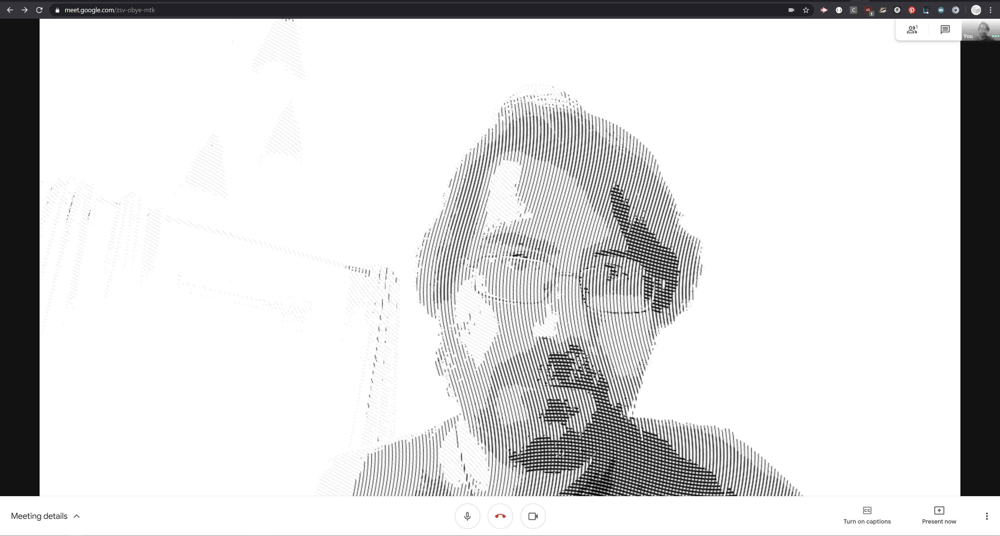

# virtual-webcam chrome extension

This is a proof of concept of adding a virtual MediaDevice in a browser extension.

To use:
- download or clone the repo
- go to chrome://extensions
- enable Developer Mode
- Load unpacked
- Browse to the folder with the extension (where the manifest.json is)
- Note:Pages will need to be reloaded after an extension is installed to be able to use it

Now any (most) pages using getUserMedia should be able to see a "Chrome Virtual Webcam" device

Caveats:
- Some pages use shims or do some checks that might break with the extension 
  - WebRTC samples: https://webrtc.github.io/samples/src/content/devices/input-output/
- For now, the Virtual Webcam takes the default webcam and applies a WebGL filter to it
  - That means that the default webcam can be the last used webcam in the system, if there are several
- Change filters in js/media-devices.js

Tested with
- Hangouts
- Meet
- Zoom
- Doesn't seem to work on Duo

Security concerns, what if a bad actor wants to capture and broadcast the stream:
- The browser will tell the user that they're using a developer extension (a bit weak as security measures go)
- The webcam light will still turn on. Doesn't solve if the actor is active during a valid video call, though.
- I guess it's possible -and probably easy- to stream from an extension to another server. Nothing is preventing any extension creator from doing it right now, without a virtual webcam. Just MitM and record.

Ideas:
- Shader editor
- Youtube video to replace feed
- Add ML like FaceMesh or other feature detection systems:
  - add privacy bar over eyes
- Try to stream from a canvas in a page (shader editor, drawing, etc.) as a MediaSource.
  
