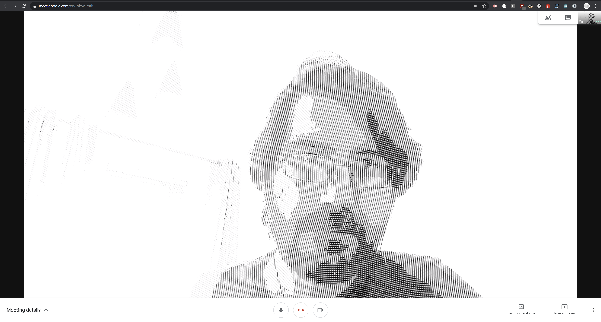

# Virtual Webcam

A browser extension that adds a virtual camera, "Virtual Chrome Webcam", to every site. Video-call apps see it as an ordinary webcam. You choose what it shows: your real camera, a tab or window, a video file, or a video playing in another tab. You can replace your background and apply live filters, written as GLSL shaders or in JavaScript with MediaPipe.



## Features

- **A virtual camera** that apps like Meet and Zoom list next to your real ones. A toggle can also make it the default camera.
- **Scenes** that combine three layers, and that you switch between in one click, even mid-call:
  - **You:** your camera, on or off, optionally mirrored.
  - **Background:** your room, blurred, an image, a tab or window, the video playing in a tab, a video file, or a video shared from any tab with a right-click. With any background other than your room, you're cut out and placed over it.
  - **Effects:** an ordered stack of filters. There are 15 built in, and you can write your own in GLSL (Shadertoy-style) or JavaScript, with MediaPipe face tracking and segmentation bundled.
- **The Studio:** a full-page editor with a live preview, for building scenes and writing effects.

## Install

Chrome or Edge (a recent version):

1. Download or clone this repository.
2. Go to `chrome://extensions` (`edge://extensions` in Edge) and turn on **Developer mode**.
3. Click **Load unpacked** and select the folder that contains `manifest.json`.
4. Reload any tabs that were already open.

Firefox 128+ can load it as a temporary add-on from `about:debugging#/runtime/this-firefox`, but support is partial and untested. See [Limitations](#limitations).

## Using it

In a video-call app, choose **Virtual Chrome Webcam** as the camera. To get it on sites that don't let you pick a camera, open the extension's popup and turn on **Use the virtual camera by default**. Sites that ask for a specific camera still get that camera.

### The popup

- **Scenes:** pick one to switch to it straight away, even mid-call.
- **Camera on / Mirror:** quick changes to the active scene.
- **Notices:** a line appears when the scene needs something that's missing, such as a video file nobody has chosen.
- **Open Studio…:** opens the Studio, where scenes are built.

The extension starts with your previous settings as **My setup**, plus four starter scenes: **Plain camera**, **Blurred background**, **Presenting** (you over a shared tab or window) and **Privacy** (blurred background with an eye bar). Delete or change them as you like.

### The Studio

The **Scenes** tab has your scenes on the left. For the selected one, it shows a live preview and its three layers.

**You**
- **Camera on/off.** With the camera off, the background is shown on its own, which is how to stream just a tab, a video or an image.
- **Mirror** and **Upside down** flip only your camera, so text in a background stays readable.

**Background**

| Background | What's behind you |
|---|---|
| Your room | Your real background. |
| Blurred room | Your background, blurred. |
| Image | An image you choose here. |
| Tab, window or screen | Chrome's picker asks which one when the scene starts. |
| Video in a tab | Pick a tab when the scene starts. The extension finds the main video playing in it and crops to it. |
| Video file | A video you choose here. It loops, without sound. |
| Shared video | Right-click a video in any tab, choose **Use this video as webcam**, then **Share**. Only the video element is captured, using Element Capture, so player controls and overlays don't appear. It stays shared until you stop it. |

**Effects:** add effects from the library, reorder them, or remove them. They're applied top to bottom. **Edit** opens an effect in the **Effects** tab.

The preview uses a test pattern or your camera. Tab and window backgrounds appear as placeholders until you click **Preview live**. Changes save as you go, and changes to the active scene reach calls immediately.

Chrome only shows its screen-sharing picker straight after a click in the page. If a scene with a tab or window background starts without one, a small **Choose…** prompt appears in the call tab first. If a background source ends (for example, you stop sharing), the camera keeps running with a "Video source ended" card, and the page offers to switch back to the camera.

## Writing effects

The Studio's **Effects** tab compiles as you type, marks errors on the right line, and previews against a test pattern, your camera or the video file. Filters can be imported and exported as files.

### GLSL shaders

Filters are Shadertoy-style GLSL ES 3.0 shaders, so most Shadertoy image filters can be pasted in as-is. Write a `mainImage` function; the camera is `iChannel0`.

```glsl
void mainImage(out vec4 fragColor, in vec2 fragCoord) {
  vec2 uv = fragCoord / iResolution.xy;
  vec3 color = texture(iChannel0, uv).rgb;
  fragColor = vec4(vec3(dot(color, vec3(0.299, 0.587, 0.114))), 1.0);
}
```

Available inputs:
- **Size and time:** `iResolution`, `iTime`, `iTimeDelta`, `iFrameRate`, `iFrame`, `iDate`.
- **Textures:** `iChannel0` is the camera; `iChannel1`–`3` are black. `iChannelResolution` gives their sizes.
- **Always zero:** `iMouse`.
- **Older shaders:** `texture2D()` works as an alias of `texture()`.

### JavaScript

A JavaScript filter defines `draw(frame, ctx, info)`, which runs for every frame, and optionally `async setup({ mediapipe })`, which runs once.
- `frame` is an `ImageBitmap`, and `ctx` is a 2D canvas context the size of the frame. Whatever you draw is the output.
- `info` has `time`, `width`, `height` and `frame` (a counter).

```js
let landmarker;

async function setup({ mediapipe }) {
  landmarker = await mediapipe.faceLandmarker({ numFaces: 1 });
}

function draw(frame, ctx, { time, width, height }) {
  ctx.drawImage(frame, 0, 0, width, height);
  for (const points of landmarker.detectForVideo(frame, time).faceLandmarks) {
    const nose = points[1];
    ctx.fillStyle = "red";
    ctx.beginPath();
    ctx.arc(nose.x * width, nose.y * height, 20, 0, Math.PI * 2);
    ctx.fill();
  }
}
```

MediaPipe Tasks Vision is bundled:
- `mediapipe.faceLandmarker(options)` returns a [FaceLandmarker](https://ai.google.dev/edge/mediapipe/solutions/vision/face_landmarker/web_js).
- `mediapipe.selfieSegmenter(options)` returns an ImageSegmenter for separating people from the background.
- `mediapipe.vision`, `mediapipe.fileset` and `mediapipe.models` give the whole API and the bundled models, for building other tasks.

Filters have no network access, so they can only use what's bundled.

### Adding a built-in effect

Add a file to `js/filters/` (see the existing ones), then list it in `manifest.json`, `popup.html`, `studio.html` and `cam.html`.

## How it works

- **The camera patch.** A content script runs in each page's own JavaScript world at `document_start`. It wraps `navigator.mediaDevices.enumerateDevices()` and `getUserMedia()`. When an app asks for the virtual camera, the extension opens the active scene's sources and runs them through a WebGL pipeline. It hands the app a generated video track (`MediaStreamTrackProcessor` → shaders → `MediaStreamTrackGenerator`).
- **Scenes and plans.** A scene is stored as layers (camera, flip, background, effect ids). On the page it becomes a plan: the main source (the camera, or the background when the camera is off), an optional second source to show behind you, the background mode and the effect chain.
- **Live switching.** All of a page's virtual camera streams share the same sources, so switching scenes updates them all without the app's track changing.
- **Settings.** They live in extension storage. A second content script, in the extension's isolated world, resolves the active scene, relays it to the page, and brokers requests that need the extension, such as opening the video file or connecting to a shared video.
- **The processor.** Shader-only scenes run in the page. Cut-out backgrounds and JavaScript effects run in a sandboxed extension page; when they're in use, the whole effect chain runs there in order, shaders included. That page is embedded in the call page as a hidden frame. Frames travel in and out as `ImageBitmap`s. Because the frame belongs to the extension, the page's own security policy (Meet's, for example) doesn't affect it. It's only added while it's needed.
- **Shared videos.** The tab with the video captures itself, restricted to the video element (Element Capture), and sends the result to the call tab over a local WebRTC connection. The background script carries the connection setup between the two tabs.

`cam.html` shows the filter pipeline used as a plain library, without the extension.

## Privacy and security

- **Nothing leaves your machine.** The extension never sends your video anywhere. Shared videos go between tabs over a local WebRTC connection.
- **Your stored video and image stay protected.** A site can only receive the stored video file, the background image or a shared video if it already has camera permission, as it would need for a real camera.
- **Filters are sandboxed.** JavaScript filters and background effects run in a sandboxed page with no network access: its security policy blocks the usual network APIs, and WebRTC is removed. That stops ordinary network calls, not a determined attacker, so only import filters you trust.
- **The usual warnings still apply.** The webcam light still turns on when the real camera is in use. Chrome shows its usual sharing indicators for tab, window and screen capture.

## Limitations

- **Sites with strict media policies.** Sites whose security policy blocks `blob:` media can't play the video file; the camera is used instead.
- **DRM-protected video.** Netflix and similar show as black in any capture.
- **Right-clicking on YouTube.** Right-click twice to get Chrome's menu instead of YouTube's. Videos inside embedded frames can't be shared yet.
- **Overlays in "Video in a tab".** That source crops a capture of the whole tab, so the player's controls show if you hover over the video. **Shared video** avoids this.
- **Sites that check devices closely.** Some sites use shims or device checks that don't expect a virtual camera; the [WebRTC device sample](https://webrtc.github.io/samples/src/content/devices/input-output/) is one.
- **Firefox:**
  - sandboxed extension pages aren't supported, so background effects and JavaScript filters don't run;
  - Element Capture and capture handles aren't available, so "Shared video" and the cropping in "Video in a tab" don't work;
  - filters freeze while the tab is in the background;
  - after an extension update, open tabs need a refresh.

Tested with Google Meet and YouTube in Chrome.

## License

This project is licensed under the [CC-BY-4.0 License](https://creativecommons.org/licenses/by/4.0/).

Third-party parts:
- The **Distorted TV** and **Money** filters are from Shadertoy ([ldXGW4](https://shadertoy.com/view/ldXGW4) by ehj1, [XlsXDN](https://shadertoy.com/view/XlsXDN) by @giacomopc). They're under Shadertoy's default licence, [CC BY-NC-SA 3.0](https://creativecommons.org/licenses/by-nc-sa/3.0/), which is stricter than this project's.
- **MediaPipe** and its models (`vendor/mediapipe/`) are under the Apache License 2.0; see `vendor/mediapipe/NOTICE.md`.
